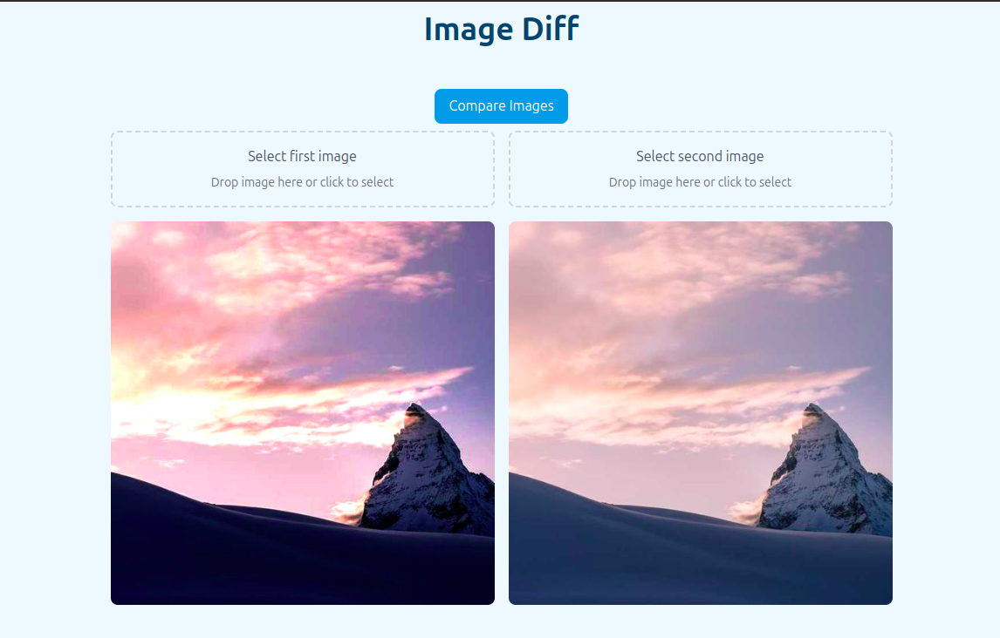
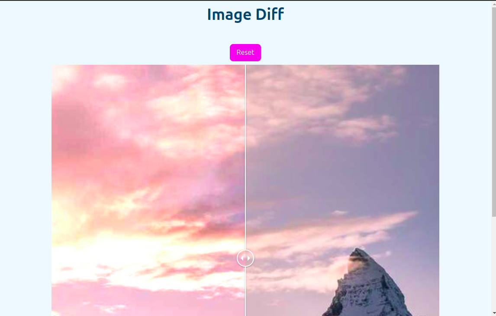

# Image Diff

## Description
Image Diff is a powerful tool designed to compare two images and highlight the differences between them. It is particularly useful for visual regression testing, ensuring that any changes in images are both intentional and expected.

## Features
- Compare two images and visually highlight differences.
- Support for various image formats, including PNG and JPEG.
- Easy-to-use interface for uploading and comparing images.

## Installation
To install Image Diff, follow these steps:

1. Clone the repository:
   ```bash
   git clone https://github.com/yourusername/image-diff.git
   ```
2. Navigate to the project directory:
   ```bash
   cd image-diff
   ```
3. Install the dependencies:
   ```bash
   npm install
   ```

## Usage
1. Start the application by running:
   ```bash
   npm run start
   ```
2. Upload two images through the interface.
3. Use the slider to switch between the images and view the highlighted differences.




## Building the Application
Currently supported on Ubuntu.

To compile the application:
```bash
npm run make
```

## Contributing
We welcome contributions! If you have an idea for improvement or have found a bug, please open an issue or submit a pull request on GitHub.

### Guidelines
- Fork the repository.
- Create a new branch for your feature or bugfix.
- Submit a pull request once your changes are complete.

## License
This project is licensed under the [MIT License](LICENSE.md).

## Contact
If you have any questions or feedback, feel free to reach out by opening an issue on GitHub.

